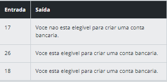
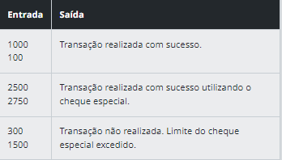
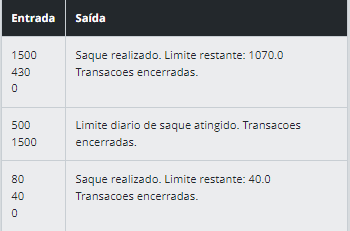

# Condições, Loops e Exceções na Prática com Java

# Sumario

1. [Operações Bancárias Simples com Switch](#operações-bancárias-simples-com-switch) - 2024-05-20
1. [Verificação de Número de Conta Bancária](#verificação-de-número-de-conta-bancária) - 2024-05-21
1. [Verificador de Idade para Conta Bancária](#verificador-de-idade-para-conta-bancária) - 2024-05-21
1. [Verificação de Cheque Especial](#verificacao-de-cheque-especial) - 2024-05-21
1. [Controle de Saques](#controle-de-saques) - 2024-05-21

## Operações Bancárias Simples com Switch

[Link pasta de respsta do desafio](/src/simulacaoBancaria/)

### Descrição

Você está desenvolvendo um programa simples em Java para simular operações bancárias básicas. A aplicação deve permitir ao usuário realizar depósitos, saques e consultar o saldo em uma conta bancária virtual.

### Entrada

O programa exibirá um menu com as seguintes opções:

1. Depositar
2. Sacar
3. Consultar Saldo
4. Encerrar
O usuário escolherá uma dessas opções digitando o número correspondente.

### Saída

Utilizando um switch, o programa realizará a operação escolhida pelo usuário.

Se o usuário escolher:

1: O programa solicitará o valor a ser depositado e atualizará o saldo.
2: O programa solicitará o valor a ser sacado e verificará se há saldo suficiente.
3: O programa exibirá o saldo atual da conta.
0: O programa encerrará.

### Exemplos

A tabela abaixo apresenta exemplos com alguns dados de entrada e suas respectivas saídas esperadas. Certifique-se de testar seu programa com esses exemplos e com outros casos possíveis.

---
## Verificação de Número de Conta Bancária

[Link pasta de resposta do desafio](/src/verificadorNumeroConta/)

### Descrição

Você está desenvolvendo um programa simples em Java para verificar se um número de conta bancária é válido. O número da conta deve ter exatamente 8 dígitos.

### Entrada

O programa solicitará ao usuário que digite o número da conta bancária.

### Saída
O programa utilizará um bloco try-catch para verificar se o número da conta possui exatamente 8 dígitos.
Se o número da conta tiver 8 dígitos, o programa informará que é um número válido.
Se o número da conta não tiver 8 dígitos, o programa lançará uma exceção (por exemplo, _IllegalArgumentException_) e informará que o número da conta é inválido.

### Exemplos
A tabela abaixo apresenta exemplos com alguns dados de entrada e suas respectivas saídas esperadas. Certifique-se de testar seu programa com esses exemplos e com outros casos possíveis.

---

## Verificador de Idade para Conta Bancária

### Descrição

Você está desenvolvendo um programa simples em Java para verificar se um cliente é elegível para criar uma conta bancária. A condição é que o cliente deve ter pelo menos 18 anos de idade.

### Entrada

O programa solicitará ao usuário que digite sua idade.

### Saída

- Utilizando apenas um bloco if e else, o programa verificará se a idade do cliente é igual ou superior a 18 anos.
- Se a idade for maior ou igual a 18, o programa informará que o cliente é elegível para criar uma conta bancária.
- Se a idade for menor que 18, o programa informará que o cliente não é elegível para criar uma conta bancária.

### Exemplos

A tabela abaixo apresenta exemplos com alguns dados de entrada e suas respectivas saídas esperadas. Certifique-se de testar seu programa com esses exemplos e com outros casos possíveis.

---

## Verificacao de Cheque Especial

### Descrição

Você está desenvolvendo um programa simples em Java para verificar se uma conta bancária ultrapassou o limite do cheque especial. A aplicação solicitará ao cliente que informe o saldo atual da conta bancária. Em seguida, o programa pedirá o valor de um saque que o cliente deseja realizar.

O limite do cheque especial será definido como 500 unidades monetárias.

### Entrada

- O programa solicitará ao usuário que informe o saldo atual da conta bancária.
- Em seguida, o programa solicitará o valor de um saque que o cliente deseja realizar.

### Saída

- O programa deverá verificar se o saque ultrapassará o saldo disponível na conta.
- Se o saque não ultrapassar o saldo, o programa informará que a transação foi realizada com sucesso.
- Se o saque ultrapassar o saldo, o programa verificará se o valor do saque ultrapassa o cheque especial (definido como 500 unidades monetárias).
    - Se ultrapassar, o programa informará que a transação não pode ser realizada devido ao limite excedido.
    - Caso contrário, o programa informará que a transação foi realizada com sucesso, utilizando o cheque especial.

### Exemplos

A tabela abaixo apresenta exemplos com alguns dados de entrada e suas respectivas saídas esperadas. Certifique-se de testar seu programa com esses exemplos e com outros casos possíveis.

---

## Controle de Saques

### Descrição

Você está desenvolvendo um programa simples em Java para auxiliar um cliente a realizar saques de uma conta bancária. O cliente pode fazer saques até atingir um limite diário predefinido.

### Entrada

- O programa solicitará ao usuário que informe o limite diário de saque.
- Em seguida, o programa solicitará ao usuário que informe o valor do primeiro saque.

### Saída

- Utilizando um laço _for_, o programa iterará sobre os saques.
- Para cada saque, o programa verificará se o valor ultrapassa o limite diário.
    - Se ultrapassar, o programa informará que o limite foi atingido e encerrará o loop.
    - Se não ultrapassar, o programa informará que o saque foi realizado com sucesso.

### Exemplos

A tabela abaixo apresenta exemplos com alguns dados de entrada e suas respectivas saídas esperadas. Certifique-se de testar seu programa com esses exemplos e com outros casos possíveis.

