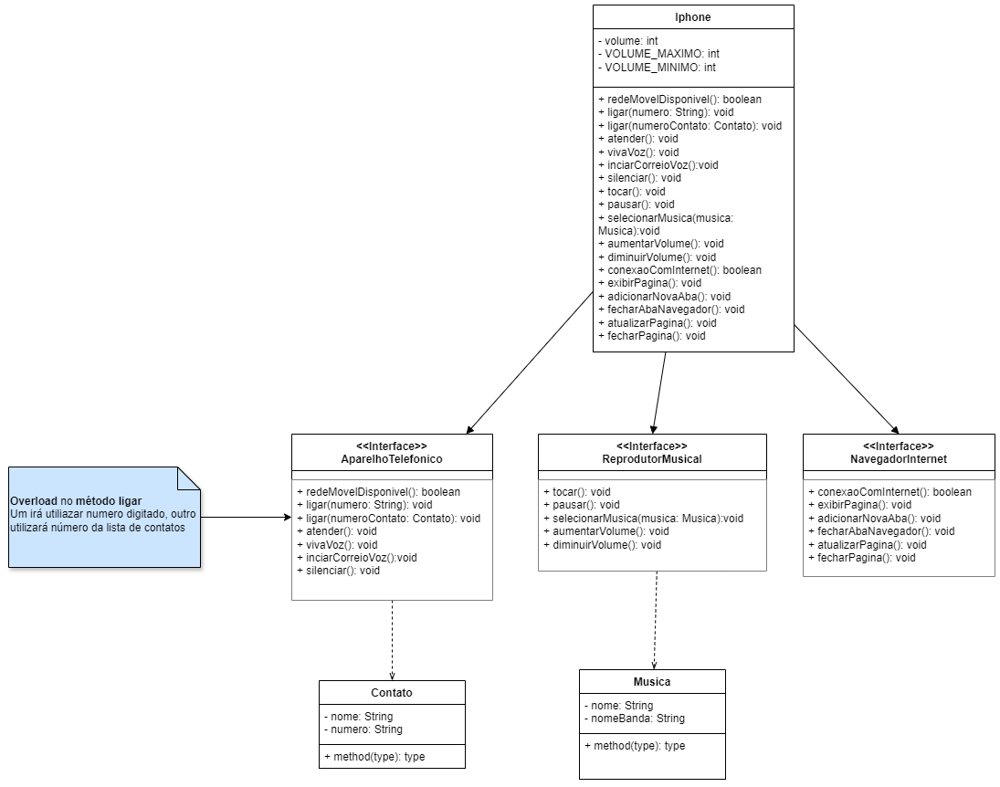
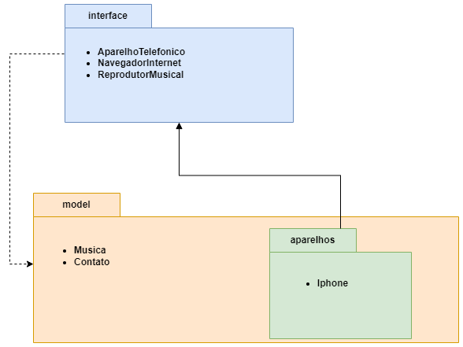
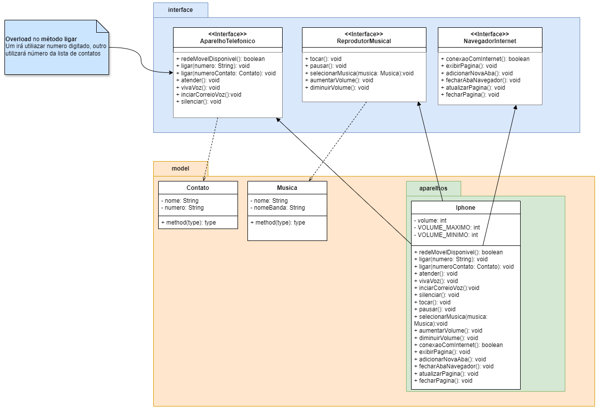

<div align="center">
  <h1>- Desafio: POO -</h1>
</div>

Este repositório, concebido com propósitos didáticos, representa um desafio de modelagem e diagramação, utilizando UML, para um componente iPhone, abrangendo suas funcionalidades como reprodutor musical, aparelho telefônico e navegador na internet, criado em colaboração entre a [Digital Innovation One](https://www.dio.me/) e o Santander, como parte do Bootcamp Santander 2024 - Backend com Java.

## Sumário

- [Objetivo](#objetivo)
- [Ferramentas e tecnologias](#ferramentas-e-tecnologias)
- [Como roda o Sistema](#como-rodar-o-sistema)
- [Diagrama UML](#diagrama-uml)
  - [Diagrama de Classes](#diagrama-de-classes)
  - [Diagrama de Pacote](#diagrama-de-pacote)
  - [Diagrama de Classe e Pacote](#diagrama-de-classe-e-pacote)
- [Descrição da organização do projeto](#descrição-da-organização-do-projeto)
  - [Pacotes](#pacotes)
  - [Interfaces](#interfaces)
    - [AparelhoTelefonico](#aparelho-telefonico)
    - [ReprodutorMusical](#reprodutor-musical)
    - [NavegadorInternet](#navegador-internet)
  - [Classes](#classes)
    - [Iphone](#iphone)
    - [SmartPhone](#smartphone)
    - [Contato](#contato)
    - [Musica](#musica)
    - [Menu](#menu)
- [Funcionamento](#funcionamento)
- [Contato](#contato)

## Objetivo

Aprender e aplicar os fundamentos de Programação Orientada a Objetos (POO) e Linguagem de Modelagem Unificada (UML), os quais incluem:

- Conceito de POO;
- Classes e pacotes;
- Visibilidade dos recursos;
- PIlares do POO;
- Interface.

## Ferramentas e tecnologias


## Como Rodar o Sistema

Para executar o sistema, siga os passos abaixo:

### Pré-requisitos

Antes de começar, certifique-se de que você possui as seguintes ferramentas instaladas em seu ambiente de desenvolvimento:

- **Java Development Kit (JDK)**: Versão 11 ou superior.
- **Git**: Para clonar o repositório.
- **Visual Studio Code (VSCode)** ou qualquer IDE de sua preferência (como IntelliJ IDEA ou Eclipse).

### Passo a Passo

1. **Clone o Repositório**

   Abra o terminal e clone o repositório para o seu ambiente local usando o comando:

   ```bash
   git clone https://github.com/LucasGFBatista/DIO-BOOTCAMP-JAVA.git
   ```

2. **Importe o Projeto na IDE**

   - Se estiver usando o **VSCode**:
     - Abra o VSCode.
     - Vá até `File > Open Folder` e selecione a pasta do projeto clonado.

   - Se estiver usando o **IntelliJ IDEA** ou **Eclipse**:
     - Utilize a opção de importação de projetos existentes e selecione a pasta do projeto clonado.

3. **Compile o Projeto**

   Abra o terminal na pasta do projeto ou utilize o terminal integrado da IDE e execute o seguinte comando para navegar até a pasta do projeto:

      ```bash
    cd Desafios/DesafioIphone

Execute o comando para compilar o projeto:

      ```

   ```bash
   javac -d bin /src/**/*.java
   ```

Caso esteja utilizando o windows

   ```bash
   javac -d bin \src\**\*.java
   ```

   Este comando compilará os arquivos `.java` e colocará os arquivos `.class` na pasta `bin`.

4". **Execute o Projeto**

   Ainda no terminal, execute o comando para rodar a classe principal `Iphone`:

   ```bash
   java -cp bin app.Iphone
   ```

   Isto iniciará o sistema e você verá o menu interativo no terminal, onde poderá selecionar as opções desejadas.

## Diagrama UML

O diagrama UML foi criado utilizando o [drawio](https://draw.io//), uma ferramenta de desenho grafico multiplataforma.

### Diagrama de Classes



### Diagrama de Pacote



### Diagrama de Classe e Pacote



## Descrição da organização do projeto

### Pacotes

- **app**

    Este pacote consta a classe [`Iphone`](#iphone), onde iniciará o sistema.
- **interfaces**

    Este pacote está resposavel pelas [interfaces](#interfaces) do projeito, que são:
  - [`AparelhoTelefonico`](#aparelhotelefonico)
  - [`NavegadorInternet`](#navegadorinternet)
  - [`ReprodutorMusical`](#reprodutormusical)


```

\---src
    |   module-info.java
    |
    +---app
    |       Iphone.java
    |
    +---interfaces
    |       AparelhoTelefonico.java
    |       NavegadorInternet.java
    |       ReprodutorMusical.java
    |
    +---model
    |   |   Contato.java
    |   |   Musica.java
    |   |
    |   \---aparelhos
    |           SmartPhone.java
    |
    \---utils
            Menu.java


```

### Interfaces

#### AparelhoTelefonico

Interface [`AparelhoTelefonico`](./src/interfaces/AparelhoTelefonico.java) responsavel por implementar as funcionalidades de um aparelho telefonico.

- **Métodos**
  - **public**
    - redeMovelDisponivel(): boolean
    - ligar() - Utilizei Overload, pois há duas possibilidades de realizar ligação
      - ligar(numero:  String): void
      - ligar(numeroContato: Contato): void
    - atender(): void
    - vivaVoz(): void
    - iniciarCorreioVoz(): void
    - silenciar(): void

#### ReprodutorMusical

Interface [`ReprodutorMusical`](./src/interfaces/ReprodutorMusical.java) é responsavel por implementar as funcionalidades de um reprodutor de música.

- **Métodos**
  - **public**
    - tocar(): void
    - pausar(): void
    - selecionarMusica(musica: Musisca): void
    - aumetarVolume(): void
    - diminuirVolume(): void

#### NavegadorInternet

Interface [`NavegadorInternet`](./src/interfaces/NavegadorInternet.java) é responsavel por implementar as funcionalidades de um navegador de internet.

- **Métodos**
  - **public**
    - conexaoComInternet(): boolean
    - exibirPagina(): void
    - adicionarNovaAba(): void
    - fecharAbaNavegador(): void
    - atualizarPagina(): void
    - fecharPagina(): void

### Classes

#### Iphone

A classe [`Iphone`](./src/app/Iphone.java) é responsavel por inicar o sistema.

 ```java
 public class Iphone {

 public static void main(String[] args) {
  Menu menu = new Menu();
  menu.exibirMenu();

 }
}
```

- **Méthodo**
  - **public**
    - **static**
      - main: void

#### SmartPhone

Esta classe implementa as classes anteriores (`AparelhoTelefonico`, `ReprodutorMusical`,`NavegadorInternet`), como solicitada no desafio. Ou seja, a classe irá constar os atributos (caso tenha) e os métodos das interfaces que são implementadas.

- **Atributo**
  - **private**
    - volume: int
      - **static**
      - MAXIMO_VOLUME: int
      - MINIMO_VOLUME: int

- **Métodos**
  - **private**
    - redeMovelDisponivel(): boolean
    - conexaoComInternet(): boolean
  - **public**
    - ligar(numero:  String): void
    - ligar(numeroContato: Contato): void
    - atender(): void
    - vivaVoz(): void
    - iniciarCorreioVoz(): void
    - silenciar(): void
    - tocar(): void
    - pausar(): void
    - selecionarMusica(musica: Musisca): void
    - aumetarVolume(volume: int): void
    - diminuirVolume(volume: int): void
    - exibirPagina(): void
    - adicionarNovaAba(): void
    - fecharAbaNavegador(): void
    - atualizarPagina(): void
    - fecharPagina(): void

#### Contato

- **Atributo**
  - **private**
    - nome: String
    - numero: String

- **Método**
  - **public**
    - getNome(): String
    - setNome(novoNome: String): void
    - getNumero(): String
    - setNumero(novoNumero: String): void

#### Musica

- **Atributo**
  - **private**
    - nomeMusica: String
    - nomeBanda: String

- **Método**
  - **public**
    - getNomeMusica(): String
    - setNomeMusica(novoNomeMusica: String): void
    - getNomeBanda(): String
    - setNomeBanda(novoNomeBanda: String): void

#### Menu

- **Atributos**
  - **private**
    - scanner: Scanner
    - iphone: SmartPhone
    - volume: int
- **Métodos**
  - **private**
    - exibirMenuAparelhoTelefonico(): void
    - exibirMenuReprodutorMusical(): void
    - exibirMenuNavegadorInternet(): void
  - **public**
    - exibirMenu(): void

## Funcionamento

Os dados são solicitados e inseridos através do terminal, onde o usuário receberá um menu indicando as opções a serem escolhidas e seus repectivos números. Por exemplo:

- Programa:  
---- Escolha o aplicativo ----  

```bash

  ####    #####    ##  ##    ####    ##  ##   ######
   ##     ##  ##   ##  ##   ##  ##   ### ##   ##
   ##     ##  ##   ##  ##   ##  ##   ######   ##
   ##     #####    ######   ##  ##   ######   ####
   ##     ##       ##  ##   ##  ##   ## ###   ##
   ##     ##       ##  ##   ##  ##   ##  ##   ##
  ####    ##       ##  ##    ####    ##  ##   ######

---- Escolha o aplicativo ---

1. Reprodutor musical  
2. Aparelho telefônico  
3. Navegador de internet  
4. Encerrar aparelho

- Usuário: 1 *(depois ENTER para o próximo passo)*

```

## Contato

Se encontrar algum erro ou tiver sugestões de melhorias, sinta-se à vontade para entrar em contato por algum dos meios abaixo ou pelos meios dispostos no meu perfil do github.

- **Email**: [lucas.gf.batista@gmail.com](mailto:lucas.gf.batista@gmail.com)
- **GitHub**: [LucasGFBatista](https://github.com/LucasGFBatista)

Agradeço por qualquer feedback que possa ajudar a melhorar este projeto!
