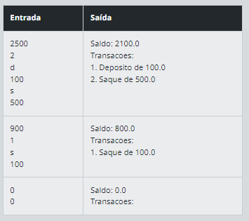
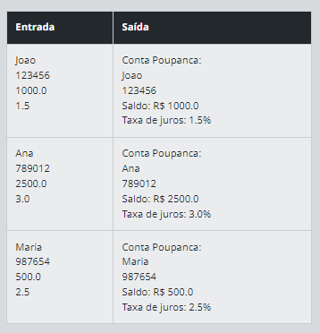

# Orientação a Objetos na Prática com Java

# Sumario

1. [Registro de Transações Bancárias](#registro-de-transações-bancárias)
1. [Registro de Transações Bancárias com Stream API](#registro-de-transações-bancárias-com-stream-api)
1. [Conta Bancária com Construtor em POO](#conta-bancária-com-construtor-em-poo)
1. [Herança Bancária: Entendendo a Herança e Polimorfismo](#herança-bancária-entendendo-a-herança-e-polimorfismo)
1. [Cofres Seguros: Dominando o Encapsulamento e Abstração](#cofres-seguros-dominando-o-encapsulamento-e-abstração)


## Registro de Transações Bancárias
### Descrição
Você está desenvolvendo um programa simples em Java para manter um registro de transações bancárias. Cada transação é armazenada em uma lista.

### Código base

```java
import java.util.ArrayList;
import java.util.List;
import java.util.Scanner;

public class RegistroTransacoesBancarias {

    public static void main(String[] args) {
        Scanner scanner = new Scanner(System.in);

        // Lê a Entrada que informa o saldo inicial da conta
        double saldo = scanner.nextDouble();

        // Lê a Entrada com a quantidade total de transações
        int quantidadeTransacoes = scanner.nextInt();

        // Lista para armazenar as transações
        List<String> transacoes = new ArrayList<>();

        // Loop para iterar sobre as transações
        for (int i = 1; i <= quantidadeTransacoes; i++) {
            // Lê a Entrada com o tipo de transação (D para depósito ou S para saque)
            // O método "toUpperCase" padroniza o tipo de transação com a letra maiúscula
            char tipoTransacao = scanner.next().toUpperCase().charAt(0);
            // Lê a Entrada com o valor da transação
            double valorTransacao = scanner.nextDouble();

            // Atualiza o saldo da conta e adicionar a transação à lista
            if (tipoTransacao == 'D') {
                saldo += valorTransacao;
                transacoes.add("Deposito de " + valorTransacao);
            } else if (tipoTransacao == 'S') {
                saldo -= valorTransacao;
                transacoes.add("Saque de " + valorTransacao);
            } else {
                System.out.println("Opção inválida. Utilize D para depósito ou S para saque.");
                i--; // Decrementa o índice para repetir a iteração
            }
        }

        // TODO: Exibir o saldo final e a lista de transações conforme a tabela de Exemplos.

        // Fechar o scanner para evitar vazamentos de recursos
        scanner.close();
    }
}

```

### Entrada
- O programa solicitará ao usuário que informe o saldo inicial da conta.
- Em seguida, o programa solicitará a quantidade total de transações que o cliente deseja realizar.

**Entrada de Transações**:
- Para cada transação, o programa solicitará ao usuário:
    - O tipo de transação: Digite 'D' para depósito ou 'S' para saque.
    - O valor da transação.

### Saída
Utilizando listas (`ArrayList` ou `LinkedList`), o programa armazenará cada transação, que incluirá um tipo (Depósito ou Saque) e um valor.
Ao final das transações, o programa exibirá o saldo final da conta e a lista de transações.
 

### Exemplos
A tabela abaixo apresenta exemplos com alguns dados de entrada e suas respectivas saídas esperadas. Certifique-se de testar seu programa com esses exemplos e com outros casos possíveis.



## Registro de Transações Bancárias com Stream API

### Descrição
Você está aprimorando o programa anterior e agora deseja utilizar a Stream API do Java para processar as transações bancárias de forma mais eficiente.

### Entrada
- O programa solicitará ao usuário que informe o saldo inicial da conta.
- Em seguida, o programa solicitará a quantidade total de transações que o cliente deseja realizar.

Entrada de Transações:
- Para cada transação, o programa solicitará ao usuário:
    - O tipo de transação: Digite 'D' para depósito ou 'S' para saque.
    - O valor da transação.

### Saída
- Utilizando a Stream API, o programa armazenará cada transação, que incluirá um tipo (Depósito ou Saque) e um valor.
- Ao final das transações, o programa exibirá o saldo final da conta e a lista de transações.
 

Exemplos
A tabela abaixo apresenta exemplos com alguns dados de entrada e suas respectivas saídas esperadas. Certifique-se de testar seu programa com esses exemplos e com outros casos possíveis.


## Conta Bancária com Construtor em POO

### Descrição

Você está desenvolvendo um programa simples em Java para representar uma conta bancária. Utilizando programação orientada a objetos (POO), você criará uma classe `ContaBancaria` com um construtor que permitirá a inicialização da conta com um saldo inicial.

### Entrada

O programa solicitará ao usuário que informe o saldo inicial da conta.
Em seguida, o programa solicitará ao usuário que realize transações de depósito e saque.

### Saída

A classe `ContaBancaria` conterá métodos para realizar depósitos e saques, atualizando o saldo da conta.
O saldo atual será exibido após cada transação.
Se o valor do saque for maior que o saldo disponível na conta, imprima uma mensagem informando: Saldo insuficiente. Saque não realizado.

### Exemplos

A tabela abaixo apresenta exemplos com alguns dados de entrada e suas respectivas saídas esperadas. Certifique-se de testar seu programa com esses exemplos e com outros casos possíveis.


## Herança Bancária: Entendendo a Herança e Polimorfismo

### Desafio

Após o sucesso no desenvolvimento do sistema básico de abertura de contas bancárias, o banco decidiu expandir seus serviços para oferecer diferentes tipos de contas. Agora, além das contas bancárias comuns, eles também oferecem contas poupança. Sua tarefa é implementar a herança e o polimorfismo no sistema, criando uma classe "ContaPoupanca" que herde da classe "ContaBancaria" anteriormente criada. A classe "ContaPoupanca" deve adicionar um novo atributo, taxa de juros, além dos atributos herdados.

Dica: Utilize a herança para criar a classe "ContaPoupanca" que herde da classe "ContaBancaria" e adicione o atributo "taxaJuros". Implemente o método "exibirInformacoes()" na classe "ContaPoupanca" para exibir as informações adicionais.

### Entrada

O programa deve solicitar ao usuário as informações necessárias para abrir uma conta poupança. A entrada deve ser feita via console (linha de comando) e deve incluir o número da conta (um valor inteiro), o nome do titular (uma sequência de caracteres), o saldo inicial da conta (um valor decimal) e a taxa de juros da conta poupança (um valor decimal).

### Saída

Após receber as informações da conta poupança, o programa deve criar um objeto do tipo "ContaPoupanca" e exibir na tela as informações dessa conta, incluindo o número da conta, o nome do titular, o saldo atual e a taxa de juros. A saída deve ser formatada de forma clara e legível para o usuário.

### Exemplos

A tabela abaixo apresenta exemplos com alguns dados de entrada e suas respectivas saídas esperadas. Certifique-se de testar seu programa com esses exemplos e com outros casos possíveis.



## Cofres Seguros: Dominando o Encapsulamento e Abstração

### Descrição

Você foi contratado para desenvolver um sistema de cofres seguros. O objetivo é criar dois tipos de cofres: um Cofre Digital, que é aberto por senha, e um Cofre Físico, que é aberto por chave.

### Entrada

O programa irá solicitar ao usuário que digite o tipo de cofre a ser criado: "digital" ou "físico". Se for escolhido o tipo "digital", o programa irá solicitar a senha e a confirmação de senha do cofre digital (ambas com apenas números). Caso seja escolhido o tipo "físico", não é necessário nenhuma outra entrada.

### Saída

O programa irá exibir as informações do cofre criado. Para o Cofre Digital, será exibido o tipo e o método de abertura (senha). Para o Cofre Físico, será exibido apenas o tipo e o método de abertura (chave).

### Exemplos

A tabela abaixo apresenta exemplos com alguns dados de entrada e suas respectivas saídas esperadas. Certifique-se de testar seu programa com esses exemplos e com outros casos possíveis.


